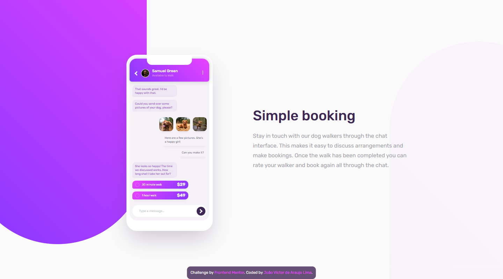
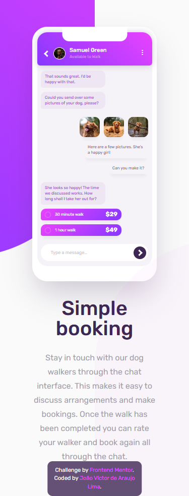

# Frontend Mentor - Chat app CSS illustration solution

## Languages
This first section is in English. 

[Versão em português logo abaixo.](#portuguese)

## Context

This is a solution to the [Chat app CSS illustration challenge on Frontend Mentor](https://www.frontendmentor.io/challenges/chat-app-css-illustration-O5auMkFqY). Frontend Mentor challenges help you improve your coding skills by building realistic projects. 

> Your challenge is to build out this feature illustration using HTML & CSS and get it looking as close to the design as possible.

## Table of contents

- [Overview](#overview)
  - [The challenge](#the-challenge)
  - [Screenshot](#screenshot)
  - [Links](#links)
- [My process](#my-process)
  - [Built with](#built-with)
  - [What I learned](#what-i-learned)
- [Author](#author)

## Overview

### The challenge

Users should be able to:

- View the optimal layout for the component depending on their device's screen size
- **Bonus**: See the chat interface animate on the initial load

### Screenshot

#### Desktop

<p align="center">
  
</p>

#### Mobile

<p align="center">
  
</p>

### Links

- Solution URL: [GitHub Repository](https://github.com/xuaun/chat-app-CSS-illustration) and [my Frontend Mentor solution page](https://www.frontendmentor.io/solutions/responsive-chat-app-css-ilustration-P_GrDFkl09)
- Live Site URL: [Live Page](https://xuaun.github.io/chat-app-CSS-illustration/)

## My process

### Built with

- Semantic HTML5 markup
- CSS custom properties
- Flexbox
- Media Query
- Keyframes

### What I learned

In this project I was able to use flexbox, variable, and media query concepts in CSS, as well as using a ready-made Figma design to create this component. I also used `rem` for measurements, and BEM methodology for naming classes.

In this project I used keyframes to animate the chat and I was quite happy with the final result.

```css
@keyframes message {
  0% {
    opacity: 0;
    transform: translateX(5rem);
  }
  80% {
    opacity: 0;
    transform: translateX(5rem);
  }
  100% {
    opacity: 1;
    transform: translateX(0rem);
  }
}
```

## Author

- Website - [João Víctor de Araujo Lima's Portfolio](https://xuaun.github.io/)
- Frontend Mentor - [@xuaun](https://www.frontendmentor.io/profile/xuaun)

____
<br>

# <p id="portuguese">Frontend Mentor - Solução do projeto de Ilustração CSS do aplicativo de bate-papo</p>

## Contexto

Esta é uma solução para o [desafio de ilustração CSS do aplicativo de bate-papo no Frontend Mentor](https://www.frontendmentor.io/challenges/qr-code-component-iux_sIO_H). Os desafios do Frontend Mentor ajudam você a melhorar suas habilidades de codificação construindo projetos realistas.

> Seu desafio é criar essa ilustração usando HTML e CSS e fazer com que ela fique o mais próxima possível do design.

## Lista de conteúdos

- [Visão Geral](#visão-geral)
  - [Desafio](#desafio)
  - [Prints](#prints)
  - [Links](#links-pt)
- [Meu processo](#meu-processo)
  - [Tecnologias utilizadas](#tecnologias-utilizadas)
  - [O que eu aprendi](#o-que-eu-aprendi)
- [Autor](#autor)

## Visão Geral

### Desafio

Os usuários devem ser capazes de:

- Visualizar o layout ideal dependendo do tamanho da tela do dispositivo
- **Bônus**: Veja a interface de bate-papo animada no carregamento inicial

### Prints

#### Computador

<p align="center">
  
</p>

#### Celular

<p align="center">
  
</p>

### <p id="links-pt">Links</p>

- Link da solução: [Repositório no GitHub](https://github.com/xuaun/chat-app-CSS-illustration) e a [página da minha solução no Frontend Mentor](https://www.frontendmentor.io/solutions/responsive-chat-app-css-ilustration-P_GrDFkl09)
- Site com a solução: [Página do projeto no ar](https://xuaun.github.io/chat-app-CSS-illustration/)

## Meu processo

### Tecnologias utilizadas

- HTML5
- CSS
- Flexbox
- Media Query
- Keyframes

### O que eu aprendi

Neste projeto eu pude utilizar conceitos de flexbox, de variáveis e de media query no CSS, além de usar um design pronto do Figma para a elaboração deste componente. Eu também usei `rem` para medidas e metodologia BEM para nomear classes.

Neste projeto eu usei keyframes para animar o chat e fiquei bastante feliz com o resultado final.

```css
@keyframes message {
  0% {
    opacity: 0;
    transform: translateX(5rem);
  }
  80% {
    opacity: 0;
    transform: translateX(5rem);
  }
  100% {
    opacity: 1;
    transform: translateX(0rem);
  }
}
```

## Autor

- Website - [Portfólio - João Víctor de Araujo Lima](https://xuaun.github.io/)
- Frontend Mentor - [@xuaun](https://www.frontendmentor.io/profile/xuaun)
